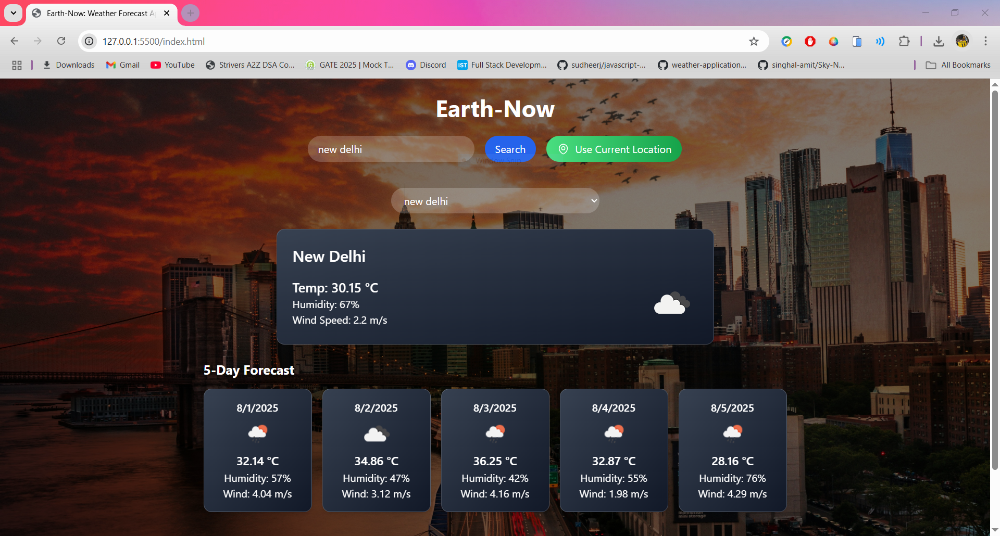
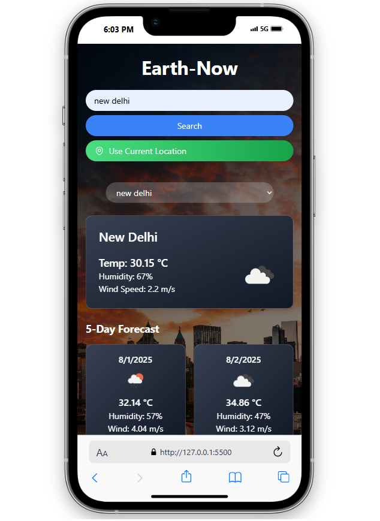

# 🌍 Earth-Now: Weather Forecast App

**Earth-Now** is a sleek, responsive weather forecast web app built with **JavaScript**, **Tailwind CSS**, and the **OpenWeatherMap API**. It provides real-time weather updates and a 5-day forecast for any location, with a stylish UI and smooth animations.

## Features

- Search weather by city name
- Get weather based on current location (via Geolocation API)
- View current conditions: temperature, humidity, wind
- 5-day extended forecast with icons
- Recent searches (with dropdown)
- Responsive design for desktop, tablet, and mobile (iPhone SE, iPad Mini)

## 🔧 Technologies Used

- **HTML5**, **JavaScript (ES6)**
- **Tailwind CSS** (CDN)
- **OpenWeatherMap API**
- **LocalStorage** for recent searches
- **Geolocation API** (for current location)

## 👨‍💻 Author

**Hardik Kumar**  
[OpenWeatherMap](https://openweathermap.org/)
